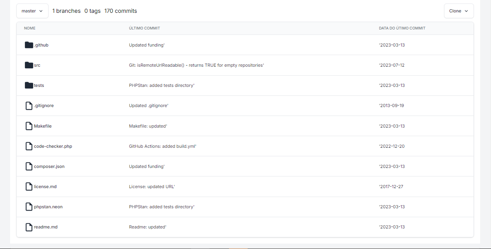

# GitDev



Github like plataform.

## Setup

note: create your own .env file

install all dependencies:

```bash
$ composer install
```

start asset server and http server:

```bash
$ php artisan serve --port=80
$ yarn dev
```

run the docker containers:

```bash
$ docker compose up -d
```

and open at http://localhost/register
